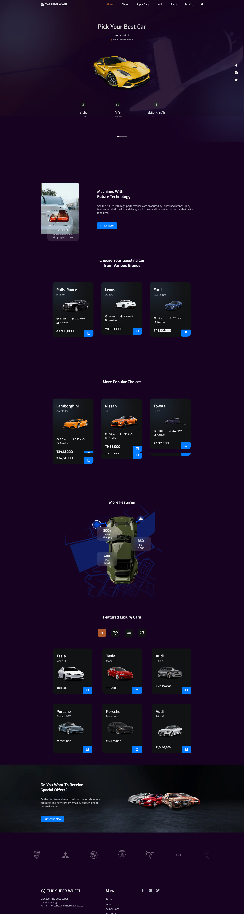
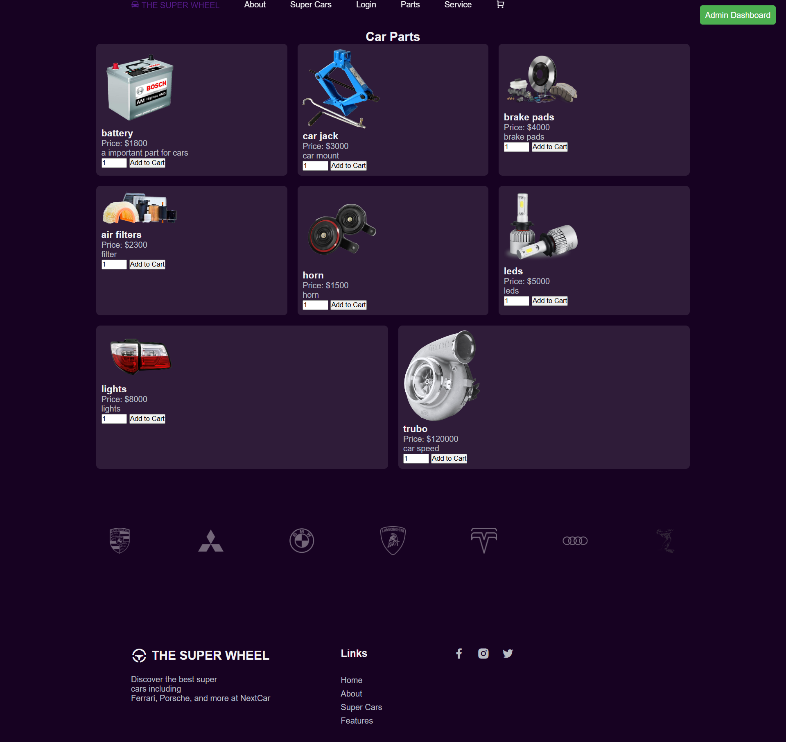
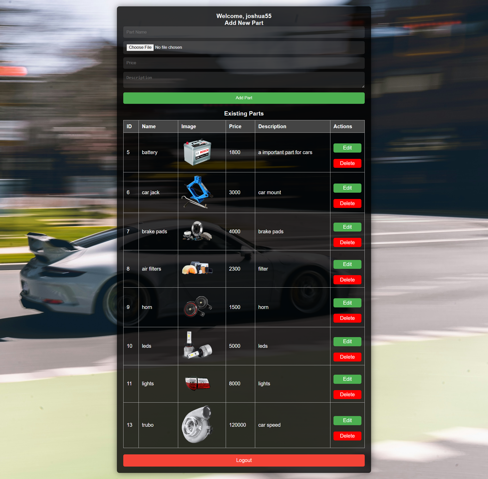
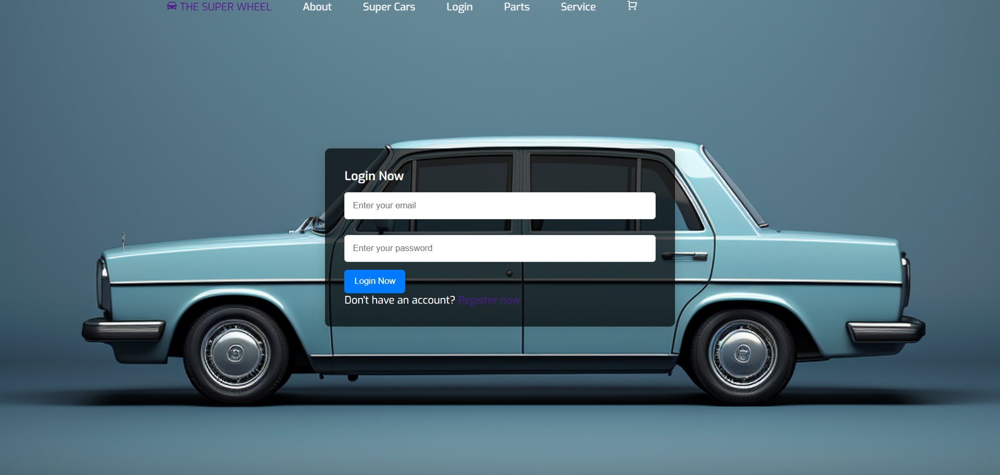

# Supercar and Accessories Selling Website

## Table of Contents
- [Project Description](#project-description)
- [Features](#features)
- [Technologies Used](#technologies-used)
- [Installation](#installation)
- [Usage](#usage)
- [Images](#images)
- [File Structure](#file-structure)
- [Contributing](#contributing)
- [License](#license)
- [Acknowledgements](#acknowledgements)

## Project Description
This project is a web application for selling supercars and accessories, providing a user-friendly interface for browsing, purchasing, and managing user accounts. It includes features for both customers and administrators to manage inventory, user accounts, and transactions.

## Features
- **User Registration and Login:** Secure user authentication system.
- **Product Browsing:** Users can view and search through a catalog of supercars and accessories.
- **Shopping Cart:** Add items to the shopping cart for purchase.
- **Checkout Process:** Complete purchases through a secure checkout page.
- **Admin Dashboard:** Administrators can manage products, users, and orders.
- **Profile Management:** Users can view and edit their profiles.
- **Order History:** Users can view their past orders.
- **Responsive Design:** Mobile-friendly layout for optimal viewing on all devices.

## Technologies Used
- **Front-end:** HTML, CSS, JavaScript
- **Back-end:** PHP
- **Database:** MySQL
- **Version Control:** Git
- **Deployment:** [GitHub Pages](https://pages.github.com/) or any PHP-compatible web server

## Installation
1. **Clone the Repository:**
   ```bash
   git clone https://github.com/joshua14134/supercar.git
   cd supercar
   ```

2. **Set Up the Database:**
   - Create a MySQL database and import the SQL schema provided in the `database.sql` file.

3. **Configure the Database Connection:**
   - Open `config.php` and update the database connection details.

4. **Run the Application:**
   - Deploy the project on a local server (e.g., XAMPP, WAMP) or a web server that supports PHP.

## Usage
- Navigate to `index.php` to access the home page.
- Users can register, log in, browse products, add items to their cart, and proceed to checkout.
- Admins can access the dashboard to manage users and products.

## Images
Here are some screenshots of the application:


*Homepage of the Supercar Selling Website*


*Indexpage of the Supercar Selling Website*


*Product Listing Page*


*Admin Dashboard for Managing Products*


*User Login Page*

## File Structure
```
/supercar
├── c_checkout.php
├── c_login.php
├── c_logout.php
├── c_parts.php
├── c_remove_from_cart.php
├── c_thank_you.php
├── check_name.php
├── config.php
├── dashboard.php
├── delete_part.php
├── delete_user.php
├── edit_part.php
├── edit_user.php
├── footer.php
├── header.php
├── index.php
├── login_form.php
├── logout.php
├── parts_page.php
├── popular.php
├── register_form.php
├── service.php
├── user_page.php
└── view_cart.php
```

## Contributing
1. Fork the repository.
2. Create a new branch (`git checkout -b feature/YourFeature`).
3. Make your changes and commit them (`git commit -m 'Add some feature'`).
4. Push to the branch (`git push origin feature/YourFeature`).
5. Open a pull request.

## License
This project is licensed under the MIT License. See the LICENSE file for details.

## Acknowledgements
- [PHP Documentation](https://www.php.net/docs.php) for server-side programming.
- [MySQL Documentation](https://dev.mysql.com/doc/) for database management.
- [W3Schools](https://www.w3schools.com/) for HTML, CSS, and JavaScript tutorials.

---
