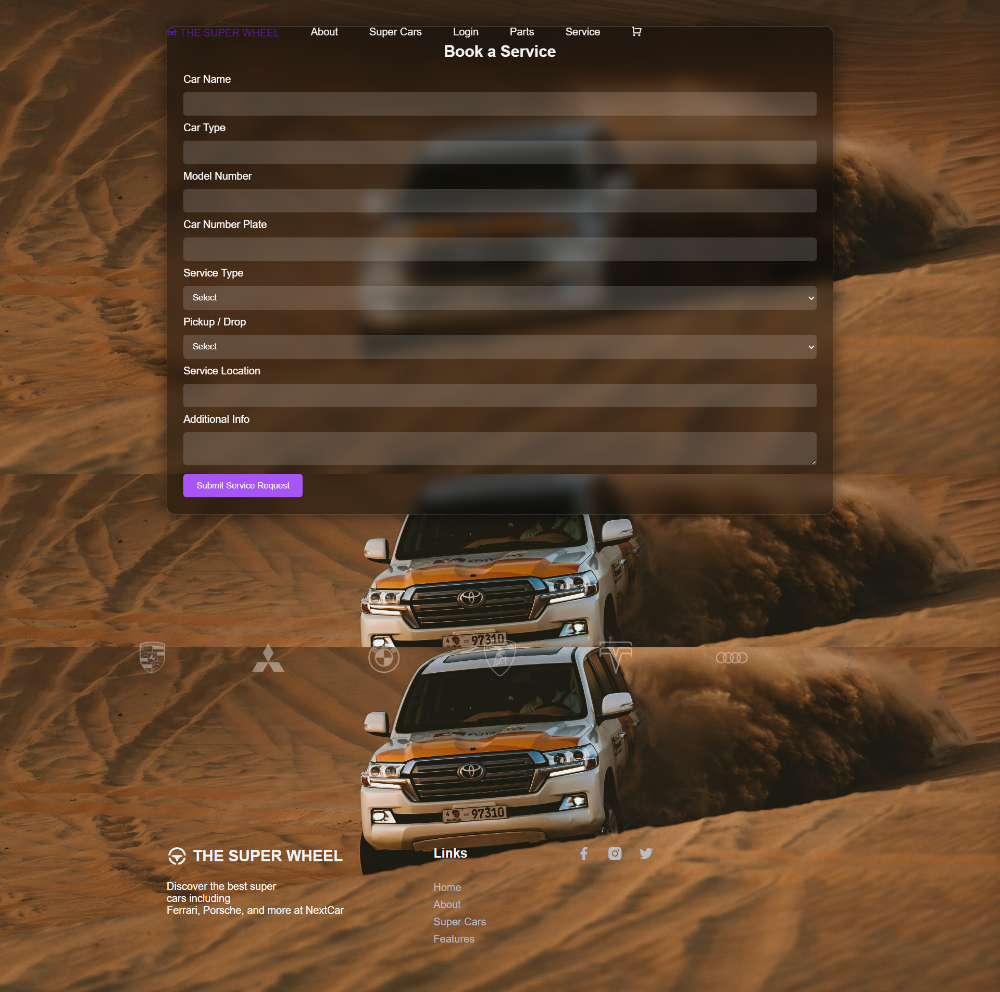
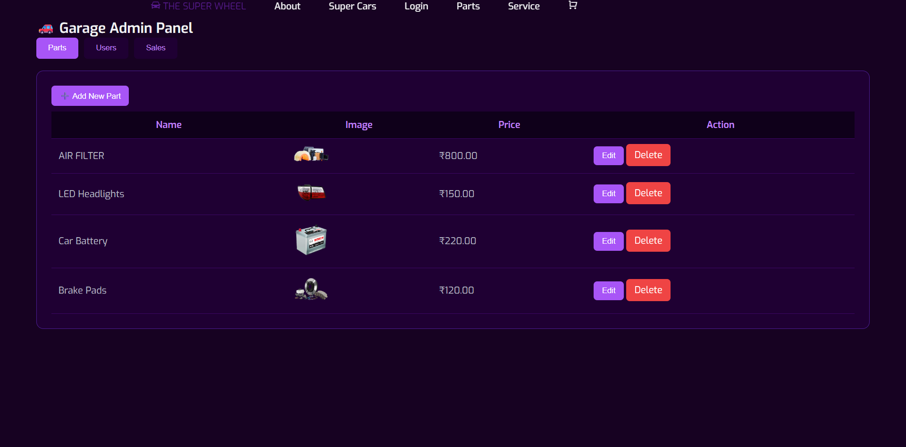

# 🚗 Supercar & Accessories E-Commerce Website

<p align="center">
  
</p>

<p align="center">
  <strong>A Full-Stack Luxury Supercar & Automotive Accessories E-Commerce Platform built using PHP and MySQL.</strong>
</p>

<p align="center">


</p>

---

# 📖 Overview

The **Supercar & Accessories E-Commerce Website** is a full-stack web application developed for buying luxury supercars and automotive accessories online.

The application provides a secure shopping experience with user authentication, shopping cart management, order processing, and an administrator dashboard for managing products, customers, and inventory.

This project demonstrates practical implementation of web development concepts including authentication, CRUD operations, session management, and MySQL database integration.

---

# ✨ Features

## 👤 Customer Module

- User Registration
- Secure Login & Logout
- Profile Management
- Browse Luxury Cars
- Browse Accessories
- Shopping Cart
- Checkout System
- Order Confirmation
- Responsive User Interface

---

## 🛠 Admin Module

- Admin Authentication
- Dashboard Overview
- Add Products
- Edit Products
- Delete Products
- User Management
- Inventory Management
- Order Monitoring

---

# 🛠 Technology Stack

| Category | Technology |
|----------|------------|
| Frontend | HTML5, CSS3, JavaScript |
| Backend | PHP |
| Database | MySQL |
| Web Server | Apache (XAMPP/WAMP) |
| Version Control | Git & GitHub |

---

# 📸 Project Screenshots

## 🏠 Home Page

<p align="center">

</p>

---

## 🔐 Login Page

<p align="center">

</p>

---

## 🛒 Shopping Page

<p align="center">

</p>

---

## 🚘 Services

<p align="center">

</p>

---

## 👤 User Profile

<p align="center">

</p>

---

## 📊 Admin Dashboard

<p align="center">

</p>

---

# ⚙️ Installation

## 1. Clone Repository

```bash
git clone https://github.com/joshua14134/supercar.git
```

```bash
cd supercar
```

---

## 2. Import Database

- Open **phpMyAdmin**
- Create a database named:

```
supercar_db
```

- Import the SQL file included in the project.

---

## 3. Configure Database

Open **config.php** and update:

```php
$servername = "localhost";
$username = "root";
$password = "";
$database = "supercar_db";
```

---

## 4. Run Project

- Copy the project folder to:

```
xampp/htdocs/
```

- Start **Apache** and **MySQL**.

Open:

```
http://localhost/supercar
```

---

# 🔒 Security Features

- Session-based Authentication
- User Login Validation
- Database Connectivity
- Input Validation
- Access Control for Admin Pages

---

# 🚀 Future Improvements

- Online Payment Gateway
- Email Verification
- Wishlist
- Product Reviews & Ratings
- Search & Advanced Filters
- Order Tracking
- Sales Reports
- Responsive Admin Dashboard
- Dark Mode
- REST API Integration

---

# 📚 Learning Outcomes

This project demonstrates:

- PHP CRUD Operations
- MySQL Database Design
- Session Management
- Authentication System
- Shopping Cart Logic
- Responsive Web Design
- Admin Dashboard Development
- E-Commerce Workflow
- Full-Stack Web Development

---

# 👨‍💻 Developer

**Joshua Greg Colaco**

GitHub: **https://github.com/joshua14134**

---

# 📄 License

This project is licensed under the **MIT License**.

---

## ⭐ Support

If you found this project useful, consider giving it a **⭐ Star** on GitHub!
